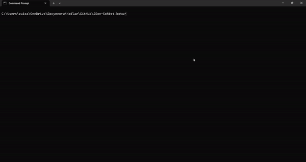
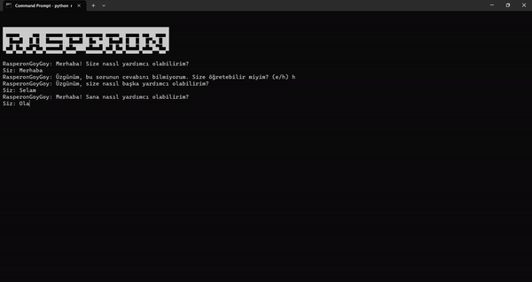
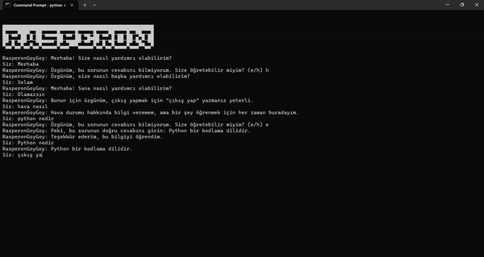

# Json kullanan, Eğitilebilir Yapay Zeka(Python)


Bu proje, kullanıcıların bir sohbet botu ile etkileşime girmelerini ve botun veritabanına yeni sorular ve cevaplar eklemesini sağlayan basit bir sohbet uygulaması oluşturmayı amaçlar. Kullanıcılar bu bot ile farklı konuları tartışabilir, yeni bilgiler öğrenebilir ve veritabanına katkıda bulunabilirler.

Bu projenin amacı, Python programlama dilini kullanarak temel bir yapay zeka sohbet botu oluşturmayı öğrenmek isteyen herkes için bir öğrenme aracı olarak hizmet etmektir. Ayrıca, kullanıcıların botun veritabanına katkıda bulunarak botun cevaplarını zenginleştirebilmelerini sağlar.

Bu proje, Python dilini öğrenenler, yapay zeka ve sohbet botları konusunda temel bilgi edinmek isteyenler veya kişisel bir projeyi başlatmak isteyenler için uygun bir başlangıç noktasıdır.


## Özellikler

🤞Kullanıcı Dostu Arayüz: CMD (Komut İstemi) ekranı üzerinden kullanıcı dostu bir arayüz sunar.

💕Sohbet Yeteneği: Kullanıcılarla metin tabanlı sohbet yapabilir ve soruları yanıtlayabilir.

💖Veritabanı Kullanımı: Kullanıcıların yeni sorular eklemesine ve botun cevaplarını öğrenmesine olanak tanır.

🎈Çıkış İşlemi: Kullanıcılar "çıkış yap" komutunu kullanarak sohbeti sonlandırabilirler.

🍿JSON Veritabanı: Soruları ve cevapları depolamak için JSON formatında bir veritabanı kullanır.

🐍Python Programlama: Python programlama dilini kullanarak basit ve anlaşılabilir bir şekilde yazılmıştır.

  
## Ekran Görüntüleri





  
## İndirme ve kullanma
Terminali açın
```bash
git clone https://github.com/rasperon/egitilebilir-sohbet-botu
```
Dosya diznine gidin
```bash
cd egitilebilir-sohbet-botu
```
Gerekli paketleri indir
```bash
pip install json
```
Projeyi çalıştır
```bash
python rasperon.py
```
  
## Ek olarak
Yıldız falan alırsa dahada geliştiririm bu arada
Sorunlar için discord gelin:
https://discord.gg/Dsec89AD23